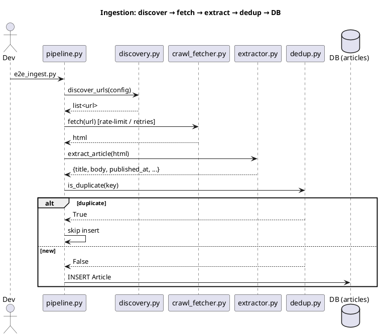
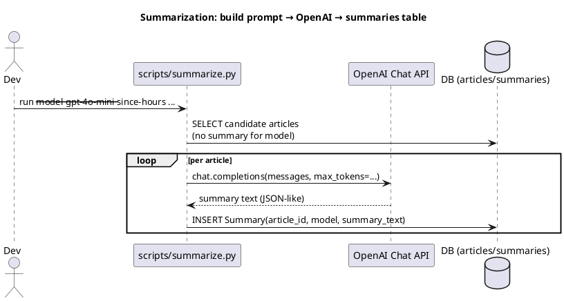
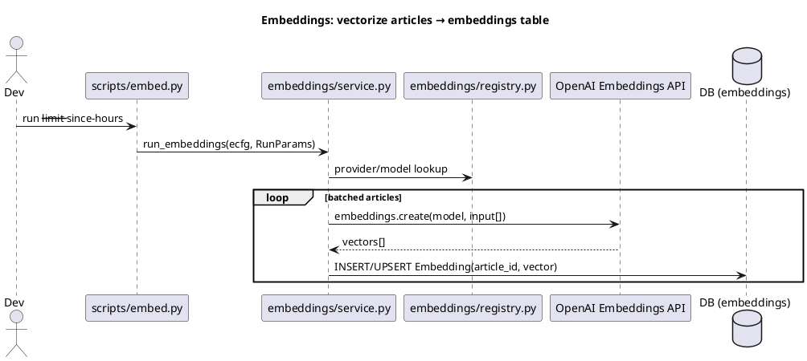
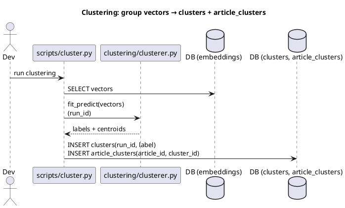
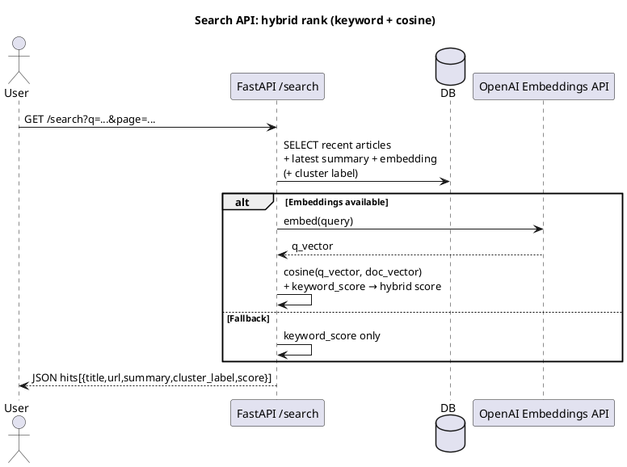

# FinGPT Summarizer

A financial news summarizer and search engine.  
It ingests articles from financial sources, summarizes them with LLMs,
embeds them for semantic search, clusters them into topics, and serves
them via a FastAPI + static UI.

---

## 📂 Project Structure

```text
FINGPT-SUMMARIZER/
├─ config/
│  └─ config.yaml                # Central runtime config (DB URL, source rules, model names, batch sizes)
│
├─ scripts/                      # CLI entrypoints (you run these)
│  ├─ _bootstrap_env.py          # Loads .env early so OPENAI_API_KEY/DB_URL are available
│  ├─ check_discovery_page.py    # Debug a single site’s discovery/extraction CSS rules
│  ├─ cluster.py                 # Run clustering over embeddings ⇒ writes clusters + article_clusters
│  ├─ db_counts.py               # Print table counts (quick sanity)
│  ├─ db_init.py                 # Create/migrate DB schema (articles, summaries, embeddings, clusters, …)
│  ├─ db_tail.py                 # Tail latest articles (title/url/time/body len)
│  ├─ e2e_ingest.py              # End-to-end: discover → fetch → extract → dedup → insert articles
│  ├─ embed.py                   # Generate embeddings for articles (calls embeddings.service)
│  ├─ run.sh                     # Orchestrates summarize → embed → start API + static UI
│  ├─ smoke_scrape.py            # Tiny ingestion smoke test for 1–2 URLs
│  ├─ summarize.py               # Summarize articles (calls summarization.summarizer / OpenAI)
│  └─ test_openai.py             # Quick OpenAI connectivity check (manual dev aid)
│
├─ src/
│  ├─ api/
│  │  └─ main.py                 # FastAPI app: /search, /clusters, /healthz (hybrid rank, SQLite-safe order)
│  │
│  ├─ app/
│  │  ├─ db.py                   # SQLAlchemy engine + session_scope()
│  │  ├─ models.py               # ORM models: Article, Summary, Embedding, Cluster, ArticleCluster
│  │  └─ tasks.py                # (optional) background tasks
│  │
│  ├─ clustering/
│  │  └─ clusterer.py            # Clustering logic (k-means/HDBSCAN) + persist run_id, labels
│  │
│  ├─ embeddings/
│  │  ├─ registry.py             # Defines EmbeddingConfig + provider registry (e.g., openai)
│  │  └─ service.py              # run_embeddings(ecfg, RunParams) ⇒ writes Embedding rows
│  │
│  ├─ ingestion/
│  │  ├─ canonicalize.py         # Normalize URLs
│  │  ├─ crawl_client.py         # Crawl4AI/HTTP client wrapper
│  │  ├─ crawl_fetcher.py        # Fetch with retries/rate-limits
│  │  ├─ dedup.py                # Duplicate detection
│  │  ├─ discovery.py            # discover_urls() from site configs
│  │  ├─ extractor.py            # Extract article fields
│  │  ├─ pipeline.py             # Full ingestion orchestrator
│  │  └─ sources.yaml            # Site configs (Reuters, MarketWatch, …)
│  │
│  ├─ static/                    # Minimal UI
│  │  ├─ search.html             # Keyword/hybrid search UI
│  │  ├─ clusters.html           # Cluster browser
│  │  ├─ js/api.js               # Tiny fetch helper
│  │  └─ css/styles.css          # Styling
│  │
│  └─ summarization/
│     ├─ llm.py                  # Thin OpenAI wrapper
│     ├─ summarizer.py           # Summarization runner
│     └─ prompts/                # Prompt templates
│
├─ .env.example                  # Sample env vars
├─ fingpt.db                     # SQLite dev DB
├─ pyproject.toml                # Poetry deps + project metadata
└─ README.md                     # This file
```

---

## 🔄 Data Flow (PlantUML)

### A) Ingestion



### B) Summarization



### C) Embeddings



### D) Clustering



### E) Search API + UI



---

## 🗄️ Schema Cheat-Sheet

- **articles**: raw items (`id, source, title, url, published_at, body_text, ...`)
- **summaries**: per-article LLM outputs (`article_id, model, summary_text, created_at`)
- **embeddings**: per-article vector (`article_id, vector, created_at`)
- **clusters**: cluster definitions (`id, run_id, label, created_at`)
- **article_clusters**: mapping (`article_id, cluster_id`)

---

## 🚀 Usage

```bash
# Install deps
poetry install

# Create schema
poetry run python -m scripts.db_init

# Ingest articles
poetry run python -m scripts.e2e_ingest

# Summarize
poetry run python -m scripts.summarize --limit 200 --since-hours 720

# Embed
poetry run python -m scripts.embed --limit 500 --since-hours 720

# Cluster
poetry run python -m scripts.cluster

# Run API
poetry run uvicorn src.api.main:app --reload --port 8000

# Open UI (served by your static server or run_all.sh)
open http://localhost:5173/search.html?api=8000
```

---

## 📊 Useful SQL Snippets

```sql
-- How many raw articles ingested
SELECT COUNT(*) FROM articles;

-- How many articles summarized
SELECT COUNT(*) FROM summaries;

-- How many embeddings generated
SELECT COUNT(*) FROM embeddings;

-- Articles still missing summaries
SELECT COUNT(*) 
FROM articles a
LEFT JOIN summaries s ON s.article_id = a.id
WHERE s.id IS NULL;

-- Articles still missing embeddings
SELECT COUNT(*) 
FROM summaries s
LEFT JOIN embeddings e ON e.article_id = s.article_id
WHERE e.id IS NULL;

-- How many clusters exist
SELECT COUNT(*) FROM clusters;

-- Show recent clusters
SELECT id, run_id, label, created_at 
FROM clusters ORDER BY created_at DESC LIMIT 10;

-- Join articles → clusters
SELECT a.id, a.source, a.title, c.label
FROM articles a
JOIN article_clusters ac ON ac.article_id = a.id
JOIN clusters c ON c.id = ac.cluster_id
ORDER BY a.published_at DESC
LIMIT 20;
```
