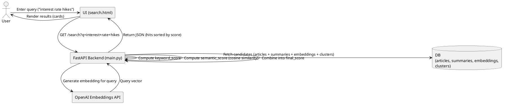

# 🔎 How Search Works in FinGPT Summarizer

The search flow is designed to let users find relevant financial articles quickly, even if the keywords don’t appear exactly in the title or summary. This is achieved with a **hybrid search**: combining keyword search (exact term matching) and embedding search (semantic similarity).

---

## 1. User Interaction
- The user opens **`search.html`** in the UI.  
- They type a query like:  

  ```
  interest rate hikes
  ```

- The UI sends a GET request to the API:

  ```
  GET /search?q=interest+rate+hikes&page=1&page_size=20
  ```

- The request may also include:
  - `window_hours`
  - `mode`
  - `use_latest_run`

---

## 2. API Handling
The FastAPI backend (`src/api/main.py`) processes `/search` requests in several steps:

1. **Fetch candidates from DB**
   - Load recent articles from the `articles` table.  
   - Attach the latest summary (from `summaries`).  
   - Attach the latest embedding (from `embeddings`).  
   - Optionally join cluster labels (from `clusters` + `article_clusters`).  

   👉 Produces a candidate set of articles (e.g., last 30 days).

---

## 3. Keyword Relevance Scoring
- Count occurrences of query terms in **title** and **summary_text**.  
- Weight matches in the **title** higher (e.g., ×2).  
- Normalize by document length.  

**Example:**  
- Title: *"Fed raises rates by 25bps"*  
- Query: *"interest rate"*  
- Score: higher, because both *interest* and *rate* appear.

---

## 4. Embedding Similarity Scoring
To capture semantic matches, even if the exact words don’t appear:

1. **Query embedding**  
   ```python
   q_vector = openai.embeddings.create(
       model="text-embedding-3-small",
       input=query
   )
   ```
   - Produces a 1536-dimensional vector.

2. **Document embeddings**  
   - Each article has a precomputed embedding stored in `embeddings.vector` (from title + summary).

3. **Cosine similarity**  
   - Compute similarity between `q_vector` and each document vector.  
   - Produces a `semantic_score ∈ [0,1]`.

**Example:**  
- Query: *"inflation slowing"*  
- Article: *"CPI growth fell below forecasts in August"*  
- Even without the word *inflation*, semantic score will be **high**.

---

## 5. Hybrid Scoring
The backend combines both signals:

```
final_score = α * keyword_score + β * semantic_score
```

- Default: `α ≈ 0.3`, `β ≈ 0.7`  
- Embeddings are weighted more, but exact keyword hits still matter.

**Example:**

| Article                                    | Keyword Score | Semantic Score | Final Score |
|--------------------------------------------|---------------|----------------|-------------|
| *Fed raises rates by 25bps*                | 0.8           | 0.9            | 0.87        |
| *CPI growth slowed, easing inflation*      | 0.2           | 0.85           | 0.65        |
| *Tech earnings rebound strongly*           | 0.0           | 0.05           | 0.03        |

---

## 6. Results Returned
- Articles sorted by **`final_score DESC`**.  
- Paginated (default 20 results per page).  

**API JSON Example:**

```json
{
  "query": "interest rate hikes",
  "page": 1,
  "page_size": 20,
  "returned": 20,
  "total_candidates": 137,
  "hits": [
    {
      "id": 42,
      "title": "Fed raises rates by 25bps",
      "url": "https://example.com/fed-raises-rates",
      "summary_text": "The Federal Reserve increased interest rates...",
      "source": "Reuters",
      "published_at": "2025-09-20T14:00:00Z",
      "cluster_label": "Fed Policy / Rates",
      "score": 0.874
    }
  ]
}
```

---

## 7. UI Rendering
The browser takes the JSON and dynamically renders results into **cards**:

- Title (clickable link)  
- Source + date  
- Cluster label (if available)  
- Score (for debugging/analysis)  
- Summary (if available)  

When the user enters a new query, the UI makes a new fetch to `/search`.  
🔄 **No refresh is needed** unless:
- The API port changes (new `config.js`), or  
- You’ve updated the HTML/JS itself.

---

## 🔑 Key Takeaways
- **Keyword search** = precision (exact matches).  
- **Embeddings** = recall (semantic similarity).  
- **Hybrid scoring** = best of both worlds.  
- Clusters help group results, but are not strictly required for ranking.  
- Results are always live — any new article ingested + summarized + embedded is instantly searchable.  

---

## 📊 PlantUML Diagram


